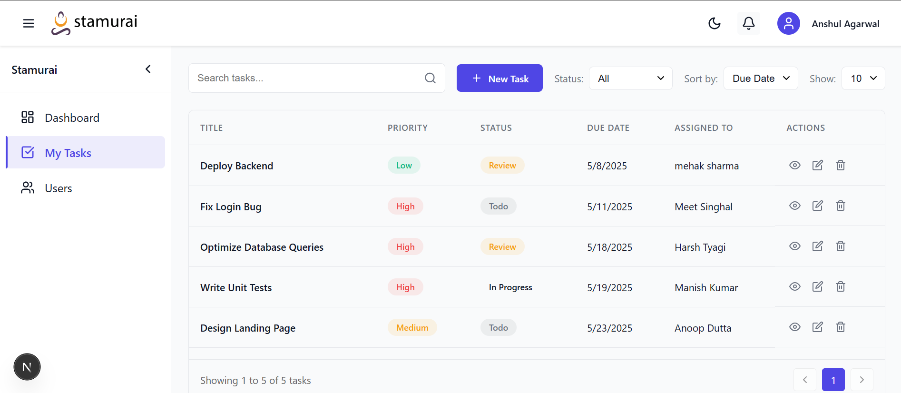
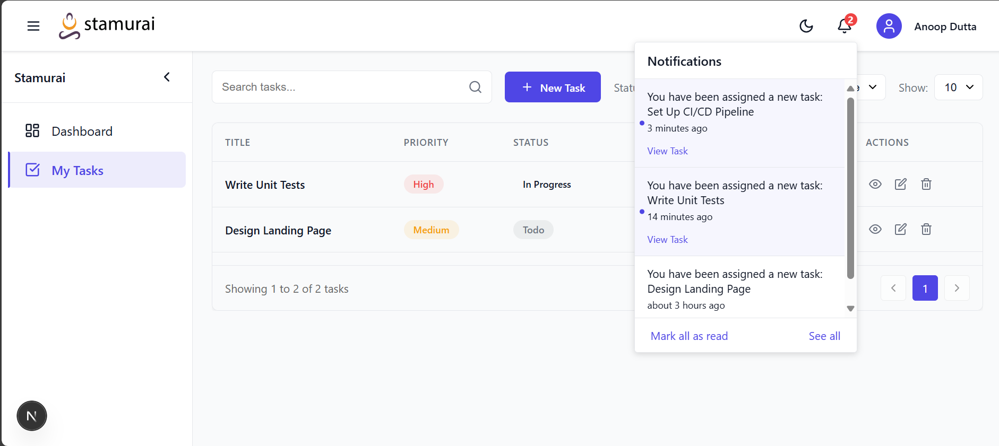

# 🚀 Stamurai Task Management System

[](https://stamurai-tms.onrender.com/)
[](https://github.com/laxitkhanpara/Stamurai-Task-Management-System)
[](https://github.com/laxitkhanpara/Stamurai-Task-Management-System/stargazers)

A robust, full-stack task management application designed for small teams to collaborate efficiently. Built with modern technologies, Stamurai TMS streamlines task workflows with intuitive interfaces and powerful features.

**[View Live Demo](https://stamurai-tms.onrender.com/) | [Explore Repository](https://github.com/laxitkhanpara/Stamurai-Task-Management-System)**

<p align="center">

  
  
  
  
  
</p>


## ✨ Features

### 🔐 User Management
- **Secure Authentication**: Industry-standard JWT-based user registration and login
- **Role-based Access Control**: Different permissions for team members and administrators
- **Profile Management**: User profiles with customizable settings

### 📋 Task Operations
- **Comprehensive CRUD**: Intuitive interfaces for creating, viewing, updating, and deleting tasks
- **Rich Task Details**: Title, description, priority levels, status tracking, and due dates
- **Task History**: Audit trails of task modifications and status changes

### 👥 Team Collaboration
- **Task Assignment**: Easily delegate tasks to team members
- **Notifications**: Real-time alerts for task assignments and updates
- **Team Visibility**: Clear overview of who's working on what

### 📊 Analytics & Dashboards
- **Personalized Dashboard**: Quick access to assigned tasks, created tasks, and overdue items
- **Performance Metrics**: Track completion rates and productivity trends
- **Progress Visualization**: Visual indicators of project and task completion status

### 🔍 Powerful Search & Filtering
- **Intelligent Search**: Quickly find tasks by title or within descriptions
- **Advanced Filtering**: Multiple filters for status, priority, due date, and assignees
- **Sorting Options**: Organize tasks by various attributes for efficient workflow management

## 🛠️ Technology Stack

### Frontend
- **Framework**: [Next.js](https://nextjs.org/) for server-side rendering and optimized performance
- **State Management**: React Context API for efficient state management
- **Styling**: CSS Modules for component-scoped styling
- **UI Components**: Custom components with responsive design

### Backend
- **Runtime**: [Node.js](https://nodejs.org/) with [Express](https://expressjs.com/) for RESTful API development
- **Authentication**: JWT-based auth flow with secure password hashing using bcrypt
- **Validation**: Request validation middleware for data integrity

### Database
- **Primary Store**: [MongoDB](https://www.mongodb.com/) for flexible document storage
- **ODM**: Mongoose for schema validation and data modeling
- **Indexing**: Optimized queries for fast search and retrieval

### DevOps
- **Deployment**: Frontend and backend deployed on [Render](https://render.com/)
- **Version Control**: Git with feature branch workflow
- **CI/CD**: Automated deployment pipeline
# 🚀 Stamurai Task Management System

## 📦 Installation & Setup

### Prerequisites
- Node.js (v14+)
- MongoDB (local or Atlas)
- npm or yarn

### Local Development

1. **Clone the repository**
   ```bash
   git clone https://github.com/laxitkhanpara/Stamurai-Task-Management-System.git
   cd Stamurai-Task-Management-System
   ```

2. **Install dependencies**
   ```bash
   # Install backend dependencies
   cd server
   npm install

   # Install frontend dependencies
   cd ../client
   npm install
   ```

3. **Configure environment variables**
   - Create `.env` files in both client and server directories
   - Example server `.env`:
     ```
     PORT=5000
     MONGODB_URI=mongodb://localhost:27017/stamurai-tms
     JWT_SECRET=your_jwt_secret
     ```
   - Example client `.env.local`:
     ```
     NEXT_PUBLIC_API_URL=http://localhost:5000/api
     ```

4. **Start development servers**
   ```bash
   # Start backend server
   cd server
   npm run dev

   # In a new terminal, start frontend
   cd client
   npm run dev
   ```

5. **Access the application**
   - Frontend: http://localhost:3000
   - Backend API: http://localhost:5000/api

## 🏗️ Architecture

The application follows a modern client-server architecture:

```
┌─────────────┐       ┌─────────────┐      ┌─────────────┐
│             │       │             │      │             │
│  Next.js    │ ───►  │   Express   │ ───► │   MongoDB   │
│  Frontend   │       │   Backend   │      │  Database   │
│             │ ◄───  │             │ ◄─── │             │
└─────────────┘       └─────────────┘      └─────────────┘
```

- **Frontend**: Responsible for UI rendering, state management, and API consumption
- **Backend**: Handles business logic, authentication, and database operations
- **Database**: Stores user data, tasks, notification and system configurations

## 📱 API Documentation

The backend exposes RESTful endpoints:

### Authentication
- `POST /api/auth/register` - Register a new user
- `POST /api/auth/login` - Authenticate a user

### Tasks
- `GET /api/tasks` - Retrieve all tasks for the authenticated user
- `GET /api/tasks/:id` - Get a specific task
- `POST /api/tasks` - Create a new task
- `PUT /api/tasks/:id` - Update an existing task
- `DELETE /api/tasks/:id` - Delete a task

### Users
- `GET /api/users` - Get all users (for task assignment)
- `GET /api/users/profile` - Get current user profile
- `PUT /api/users/profile` - Update user profile

### Notification
- `GET /api/notifications` - Get user notifications
- `PUT /api/notifications/:id` - Mark notification as read
- `PUT /api/notifications/read-all` - Mark all notifications as read
- `DELETE /api/notifications/:id` -  Delete notification
- `GET /api/notifications/unread-count` - Get unread notification count

## 🔒 Security Measures

- JWT authentication with token expiration
- Password hashing using bcrypt
- Input validation and sanitization
- Protected API routes with authentication middleware
- CORS configuration for secure cross-origin requests

## 🧪 Testing

The application includes unit and integration tests:

```bash
# Run backend tests
cd server
npm test

# Run frontend tests
cd client
npm test
```

## 🚀 Deployment

The application is deployed using Render:
- Frontend: https://stamurai-tms.onrender.com/
- Backend API: https://stamurai-task-management-system-w5a1.onrender.com

## 👥 Contributing

Contributions are welcome! Please feel free to submit a Pull Request.

1. Fork the repository
2. Create your feature branch (`git checkout -b feature/amazing-feature`)
3. Commit your changes (`git commit -m 'Add some amazing feature'`)
4. Push to the branch (`git push origin feature/amazing-feature`)
5. Open a Pull Request

## 📄 License

This project is licensed under the MIT License - see the LICENSE file for details.

## 📬 Contact

Laxit Khanpara - [GitHub](https://github.com/laxitkhanpara)
[Linkedin](www.linkedin.com/in/laxit-khanpara)
[email](laxitkhanpara3646@gmail.com)

Project Link: [https://github.com/laxitkhanpara/Stamurai-Task-Management-System](https://github.com/laxitkhanpara/Stamurai-Task-Management-System)

---

<p align="center">
  <sub>Built with ❤️ for Stamurai's take-home assignment</sub>
</p>
